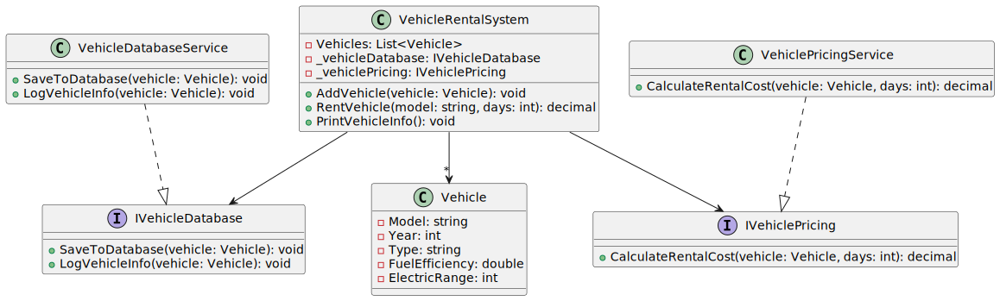

# codeRefactoring
# Vehicle Rental System

## Overview

This project is a **Vehicle Rental System** designed to manage and rent vehicles. The system follows the **SOLID principles** for object-oriented design and implements **Dependency Injection** for flexibility and testability. It supports different vehicle types, calculates rental costs, and manages vehicle data.

### SOLID Principles Applied:
- **Single Responsibility Principle (SRP):** Each class has only one responsibility (e.g., vehicle data, vehicle pricing, vehicle storage).
- **Open/Closed Principle (OCP):** The system is open for extension but closed for modification.
- **Liskov Substitution Principle (LSP):** Subtypes can replace base types without altering the correct behavior.
- **Interface Segregation Principle (ISP):** Clients interact only with interfaces that are relevant to them.
- **Dependency Inversion Principle (DIP):** The system depends on abstractions (interfaces), not concrete classes.

## Requirements

- **.NET SDK** (Core or 5+)
- A text editor or IDE of your choice (e.g., Visual Studio Code, Visual Studio)
- C# knowledge to understand the design patterns and principles used

## Project Structure

1. **Vehicle**: The data model representing a vehicle in the fleet.
2. **VehicleDatabaseService**: Handles saving and logging vehicle data.
3. **VehiclePricingService**: Calculates rental cost based on vehicle type and rental duration.
4. **VehicleRentalSystem**: Manages a collection of vehicles and coordinates vehicle renting.

## Diagram:

